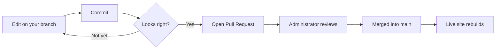
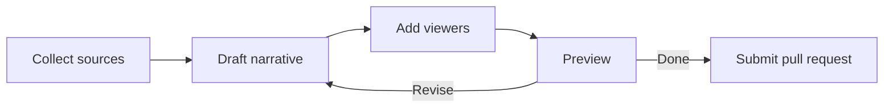

<style>
    @media (min-width: 1650px) {
        #main-wrapper>.container {
            max-width: 1600px;
            padding-left: 1.75rem !important;
            padding-right: 1.75rem !important;
        }
    }
    .example {
        display: grid;
        gap: 1rem;
    }
    @media (min-width: 640px) {
        .example {
            grid-template-columns: 1fr 1fr;
        }
    }
    iframe {
        width: 100%;
    }

    span.s2 {
        overflow-wrap: anywhere;
    }

    /* Bookmarklet drag zone */
    .guide-drag-zone {
        display: flex;
        flex-direction: column;
        align-items: center;
        gap: 1.25rem;
        padding: 2rem;
        border: 2px dashed var(--border-color, #444);
        border-radius: 12px;
        background: var(--card-bg, rgba(255,255,255,0.03));
        margin: 1.25rem 0;
    }
    .guide-drag-zone p {
        margin: 0;
        opacity: 0.65;
        font-size: 0.9rem;
    }
    #guide-bookmarklet-link {
        display: inline-flex;
        align-items: center;
        gap: 0.5em;
        padding: 0.7em 1.3em;
        background: var(--link-color, #4a9eff);
        color: #fff !important;
        border-radius: 8px;
        font-weight: 700;
        font-size: 1rem;
        text-decoration: none !important;
        cursor: grab;
        box-shadow: 0 4px 16px rgba(0,0,0,0.25);
        transition: transform 0.15s, box-shadow 0.15s;
        user-select: none;
    }
    #guide-bookmarklet-link:hover {
        transform: translateY(-2px);
        box-shadow: 0 6px 20px rgba(0,0,0,0.35);
    }
    #guide-bookmarklet-link:active { cursor: grabbing; }

    /* Allow long lines in fenced code blocks to wrap rather than scroll.
       Targets both rouge-table code blocks (.rouge-code pre) and the refactored
       non-table structure (.highlight > code). Specificity (0,2,1) beats Chirpy's
       .highlight table td pre { word-break: normal } at (0,1,3). */
    .highlight .rouge-code pre,
    .highlight > code {
        white-space: pre-wrap;
        overflow-wrap: break-word;
    }

    /* Prevent Markdown content tables from causing horizontal scroll.
       Chirpy's %table-cell placeholder compiles to .table-wrapper > table tbody tr td
       (specificity 0,1,4) and sets white-space: nowrap. The selectors below match that
       exact specificity so source order (this inline style block is later in the document
       than the external Chirpy CSS) makes our rules win.
       overflow-wrap/word-break: normal prevents mid-word breaks and forces table-layout:auto
       to size columns based on the longest unbreakable token (e.g. Esri_WorldPhysical). */
    .table-wrapper > table {
        width: 100%;
        min-width: 0;
    }
    .table-wrapper > table tbody tr td,
    .table-wrapper > table thead tr th {
        white-space: normal;
        overflow-wrap: normal;
        word-break: normal;
    }
    /* pre-wrap lets code with internal spaces break at those spaces (e.g. Liquid include
       strings); overflow-wrap/word-break: normal prevents mid-word breaks for space-free
       tokens and overrides Chirpy's code.highlighter-rouge { overflow-wrap: break-word } */
    .table-wrapper > table tbody tr td code,
    .table-wrapper > table thead tr th code {
        white-space: pre-wrap;
        overflow-wrap: normal;
        word-break: normal;
    }
</style>

# Welcome

This guide is written for students and program participants who will author interactive visual narratives on this site. By the end of it you will be able to:

* Edit pages directly in your browser and see your changes within seconds
* Write a visual narrative using only Markdown
* Add interactive images, side-by-side comparisons, maps, videos, network diagrams, and timelines
* Create those visuals from links in your own writing
* Submit a finished narrative for review and publication

No prior experience with [GitHub](https://github.com/), [Jekyll](https://jekyllrb.com/), or [Markdown](https://www.markdownguide.org/) is assumed. It is assumed that a StoryKit site has already been created for your class or program, and that an administrator will add your GitHub username to it so you can contribute. Read straight through the first time, then come back to individual sections as a reference while you are writing.

---

# Part 1 — What You Are Doing

## What Is StoryKit?

**StoryKit** is a Markdown-first framework for creating and displaying visual narratives. It evolved from **[Juncture](https://labs.jstor.org/projects/juncture/)**, which grew out of a 2018 digital humanities collaboration between **[JSTOR Labs](https://labs.jstor.org)** and **[Dumbarton Oaks](https://www.doaks.org/)**, with one straightforward goal:

> Enable students and scholars to create interactive visual narratives using Markdown — without requiring coding skills.

Juncture was created to make it easier to build web-based visual narratives that combine prose with rich visual and interactive content. StoryKit keeps that same core idea but in a simpler, more maintainable form: it is built directly on **Jekyll** (the tool GitHub uses to turn plain text into websites) and the **Chirpy** theme, rather than relying on heavy custom infrastructure.

For authors, the important point is that StoryKit lets you write mostly in regular Markdown and add special instructions wherever you want interactive viewers to appear: images, maps, videos, network diagrams, timelines, and more. You do not need to understand the technical details. You just need to know how to edit a Markdown file, add the appropriate viewer instructions, preview your work, and submit it for review.

If you want more background on how StoryKit fits together, see the [StoryKit Overview](storykit-overview). But you don't need it to get started — everything essential is in this guide.

## What You Are Creating

A **visual narrative** is a web page that combines written text with interactive media. A StoryKit visual narrative may include:

* Text written in Markdown
* Plain images and high-resolution zoom-and-pan viewers
* Side-by-side before/after image comparisons
* Maps with markers, custom layers, and fly-to animations
* YouTube videos with timestamp jumping
* Node-and-edge network diagrams built from a few lines of simple data
* Embedded timelines and other interactive content
* Mathematical equations rendered by MathJax
* Flow charts, sequence diagrams, and other diagrams drawn with Mermaid

You write the narrative in a plain text file using Markdown, with StoryKit instructions added where interactive viewers should appear. When the site is published, GitHub Pages and Jekyll convert that file into a finished web page.

## A Few Terms You Should Know

You don't need to be a GitHub or Jekyll expert, but a few terms come up throughout this guide.

**GitHub repository.** The website is stored in a GitHub repository. Think of the repository as the project folder for the website. It contains every file needed to build the site, including all the visual narratives. This site's repository is [github.com/{{ site.github.username }}/{{ site.github.repository }}](https://github.com/{{ site.github.username }}/{{ site.github.repository }}).

**Branch.** A Git concept for an independent copy of a repository. The repository has a `main` branch from which the live site is built; only designated administrators can change `main` directly. When you create a branch, you get your own copy of `main` to work in. You can create and edit files, preview your work, and revise freely without affecting the live site. Your changes stay on your branch until an administrator reviews and merges them into `main`.

**Commit.** GitHub's version of a save. When you commit, you save your changes to your branch. Each commit can include a short comment ("commit message") describing what changed, such as *Add introduction section* or *Fix typo in caption*.

**Jekyll.** The tool that turns the source files into finished web pages. You will never run Jekyll yourself. GitHub Pages runs Jekyll automatically when the site is published, and the preview tool imitates the same process so you can check your work in advance.

**Markdown.** A simple way to write formatted text using plain text. Headings, lists, links, and emphasis all have lightweight equivalents in Markdown that are much easier to type than HTML.

**StoryKit viewer.** An interactive element you can insert into a visual narrative: an image viewer, a map, a YouTube video, and so on. Viewers are added with **Liquid include tags**. Liquid is the templating language used by Jekyll; an *include* tag is a short instruction that tells Jekyll to insert a pre-built component at that point in the page. For a StoryKit viewer the tag looks like ``. You supply the attribute values, and Jekyll handles the rest.

**Preview tool.** A small utility that lets you see how your visual narrative will look on the live site, without waiting for GitHub Pages to rebuild. It renders the page the same way the live site does.

**Pull request.** How you ask for your completed changes to be reviewed and possibly published. When your narrative is ready, you open a pull request from your working branch into `main`. An administrator reviews the changes and decides whether to merge them.

---

# Part 2 — Getting Started

## Before You Begin

Before you begin authoring, you need:

* A GitHub account
* Your GitHub username added to [this site's repository](https://github.com/{{ site.github.username }}/{{ site.github.repository }}) with permission to create branches and edit files

An administrator will add your GitHub username to the repository. If you can view the repository in GitHub but you don't see a pencil icon next to files, or you can't create a branch, your account hasn't been added yet. Contact the administrator.

## Creating a GitHub Account

GitHub is a free service. To create an account:

1. Go to <https://github.com> and click **Sign up**.
2. Use an email address you can check. School or work email works fine.
3. Pick a username. Your username will appear in URLs and in commit history, so choose something you don't mind being public. Many people use a variant of their name.
4. Verify your email through the confirmation message GitHub sends.

<blockquote class="prompt-tip"><p><strong>Pick your username carefully.</strong> Changing it later is possible but breaks links to your work. A short, professional-looking username serves you well past this program.</p></blockquote>

Once your account is active, share your username with the administrator so it can be added to the repository.

## Working on Your Own Branch

Once you have access to the repository, start by creating a branch for your work.

1. Open the [repository on GitHub](https://github.com/{{ site.github.username }}/{{ site.github.repository }}). Near the top-left of the file list you will see the **branch selector**, a small button labelled with the current branch name (usually **main**) and a downward arrow.
2. Click the branch selector. In the box that appears, type a branch name. Use lower-case letters and hyphens, for example `bridge-narrative`, `mary-map-updates`, or `team-canyon-draft`. Pick something that briefly describes your work.
3. Click **Create branch: `<your-name>` from `main`**.

You are now on your own branch. Any edits you make from this point on affect only this branch until you ask for them to be merged into `main`.



<blockquote class="prompt-tip"><p><strong>Why work on a branch?</strong> While you experiment on your branch, the published version of the site keeps rendering from <code>main</code>. Nothing you do on a branch is visible to the public until an administrator merges it in.</p></blockquote>

Throughout the rest of the guide, **always check that the branch selector shows your branch (not `main`) before editing.** The branch selector is visible at the top of the file list any time you are browsing the repository; check it every time you return to GitHub to continue working.

## Editing a File on GitHub

Most of your authoring time will be spent editing files you have already created. To edit any file in the repository:

1. Confirm the branch selector shows your branch.
2. Navigate to the file. For example, click into the `_posts` folder and then click your narrative's `.md` filename.
3. GitHub shows the rendered preview of the file. To edit it, click the **pencil icon** (✏) in the upper-right area of the file view, near the **Raw** and **Download** buttons.
4. The editor opens. Make your changes.
5. When finished, scroll down to the **Commit changes** section at the bottom of the page.
6. Optionally type a short description of what you changed (e.g. *Add map viewer for section 2*).
7. Leave "Commit directly to the `<your-branch>` branch" selected, then click **Commit changes**.

Your changes are saved to your branch and are immediately available to preview.

<blockquote class="prompt-tip"><p><strong>The GitHub editor has a Preview tab</strong> (at the top of the editing area) that shows basic Markdown formatting: headings, bold, italics, and lists. It is handy for checking paragraph structure. However, it does <strong>not</strong> render StoryKit viewers; those show as raw code in GitHub's preview. Use the bookmarklet preview tool to see viewers rendered correctly.</p></blockquote>

## Using the Preview Tool

When you commit a change on GitHub, the live site does not update immediately. GitHub Pages must rebuild the entire site, which takes one to five minutes. During that wait you cannot see your edits.

The **StoryKit preview tool** sidesteps that wait by rendering a single file directly from your branch, usually in under five seconds.

### One-time setup

You install the preview tool by dragging a bookmarklet into your browser's bookmarks bar. You only do this once per browser.

1. Make sure your bookmarks bar is visible:
   * Chrome / Edge: <kbd>⌘⇧B</kbd> on macOS, <kbd>Ctrl</kbd>+<kbd>Shift</kbd>+<kbd>B</kbd> on Windows
   * Firefox: View menu → Toolbars → Bookmarks Toolbar
   * Safari: View menu → Show Favorites Bar
2. **Drag** the button below into your bookmarks bar. Do not click it — drag it.

<div class="guide-drag-zone">
  <a id="guide-bookmarklet-link" href="#" title="Drag me to your bookmarks bar">🔖 Preview on GitHub</a>
  <p>Drag the button above to your bookmarks bar</p>
</div>

<script>
(function() {
  var previewUrl = '{{ site.url }}{{ site.baseurl }}/preview';

  var code = "(function(){" +
    "var m=location.href.match(/github\\.com\\/([^/]+)\\/([^/]+)\\/blob\\/([^/]+)\\/(.+\\.md)/);" +
    "if(!m)return alert('Navigate to a .md file in GitHub first');" +
    "var p=JSON.stringify({o:m[1],r:m[2],ref:m[3],p:m[4]});" +
    "window.open('" + previewUrl + "#'+encodeURIComponent(p),'_blank');" +
    "})();";

  var link = document.getElementById('guide-bookmarklet-link');
  if (link) {
    link.href = 'javascript:' + code;
    link.addEventListener('click', function (e) {
      e.preventDefault();
      alert('Drag this button to your bookmarks bar — do not click it.');
    });
  }
})();
</script>

3. Confirm that a new bookmark labelled *Preview on GitHub* now appears in your bookmarks bar.

The bookmarklet reads the current GitHub page address and builds the preview URL for you, so you don't have to construct it by hand.

### Raising the preview's rate limit (recommended)

The preview tool reads your file from GitHub's servers. Without a token, GitHub limits you to a handful of preview loads per hour — fine for a quick look, frustrating for a working session. Adding a free **personal access token** raises the limit to 5,000 loads per hour, effectively unlimited.

1. Go to [github.com/settings/tokens/new](https://github.com/settings/tokens/new) *(sign in if prompted)*.
2. In the **Note** field type `Jekyll Preview`, choose an expiration, and — important — **do not check any permission boxes**.
3. Click **Generate token** and **copy the token** that appears (it starts with `ghp_`). You won't be able to see it again after leaving the page.
4. Open the preview page at [{{ site.url }}{{ site.baseurl }}/preview]({{ site.url }}{{ site.baseurl }}/preview), click the **⚙ Config** button in the top bar, enter `1`, then paste your token.

The token is saved in your browser; you won't need to enter it again unless you clear your browser data or switch browsers. The [Preview Setup guide](storykit-preview-setup) covers this in more detail, including what the preview can and can't show.

### Day-to-day use

Once the bookmarklet is installed:

1. Open the repository on GitHub and navigate to your `.md` file in the `_posts` folder.
2. Click **Preview on GitHub** in your bookmarks bar.
3. A new tab opens with the file rendered the same way the live site would render it.

<blockquote class="prompt-tip"><p><strong>Work with two browser windows side by side.</strong> Keep GitHub open in one window and the preview in the other. After each commit, switch to the preview window and reload. This edit-commit-reload cycle makes it easy to catch problems before they pile up.</p></blockquote>

<blockquote class="prompt-warning"><p><strong>If the preview fails to open</strong>, check that you launched the bookmarklet while looking at a <code>.md</code> file (not a folder or another file type). The bookmarklet only works on <code>.md</code> pages inside a repository.</p></blockquote>

---

# Part 3 — Markdown Basics

The text of every visual narrative is written in **Markdown**, a plain-text format for writing styled documents. You will never need to write HTML by hand. Markdown is small enough to learn in an afternoon; the rest of this part covers everything you need for a polished article.

For a comprehensive Markdown reference, see [Markdown Guide](https://www.markdownguide.org/). If you want to experiment with Markdown before using it in a narrative, web-based playgrounds such as [Dillinger](https://dillinger.io/) let you type Markdown on one side and see the rendered result instantly on the other, with no setup required.

A Markdown file has two parts:

1. **Front matter**: a block at the very top, between two `---` lines, that tells the site what the post is and how to display it.
2. **Body**: everything below the front matter. This is your narrative.

A minimal narrative looks like this:

```markdown
---
title: The Golden Gate Bridge
description: A short history of an American icon.
author: Your Name
date: 2026-09-15
categories: ["Landmarks"]
tags: [bridges, san-francisco]
published: false
featured: false
media_subpath: /assets/posts/golden-gate-bridge
image:
  path: golden_gate_header.jpg
  alt: The Golden Gate Bridge emerging from fog
---

On a foggy morning in 1937...
```
{: .nolineno }

Each front matter field plays a role:

| Field | What it does |
|---|---|
| `title` | The page heading and browser tab title |
| `description` | A one-paragraph summary shown in search results and on article cards |
| `author` | Your name as it should appear in the by-line. For more than one author, use the list form instead: `authors:` followed by one indented `- Name` line per author |
| `date` | Publication date; must match the date prefix in the file name |
| `categories` | One or two broad subject categories used to group articles on the site — e.g. `["Landmarks"]` or `["Landmarks", "Engineering"]` |
| `tags` | Any number of keyword tags for filtering and search — e.g. `[bridges, san-francisco]` |
| `published` | Set to `false` while drafting; change to `true` when you submit the pull request |
| `featured` | Set to `true` to highlight the article on the home page; leave `false` unless asked by an administrator |
| `storykit` | StoryKit extensions are **enabled by default** — you do not need this field. Add `storykit: false` only if you want to disable all viewers on a specific page |
| `media_subpath` | The folder where your uploaded images live. Must match the folder name in `assets/posts/` exactly (see §3.1) |
| `image.path` | The header image shown on the article card and at the top of the page. Use a `wc:` shorthand for a Wikimedia Commons file (e.g. `wc:GoldenGateBridge-001.jpg`) or a local filename. Aim for an image that looks good at roughly 16:9 landscape proportions |
| `image.alt` | A brief text description of the header image, used for screen readers and accessibility |

<blockquote class="prompt-tip"><p>StoryKit extensions are enabled by default — you do not need a <code>storykit:</code> line in your front matter. The only time you would add it is <code>storykit: false</code> to explicitly disable all viewers on a specific page, or a <code>storykit:</code> settings block to fine-tune layout behavior (see the <a href="storykit-display-modes">Display Modes guide</a>).</p></blockquote>

The file `_posts/.template.md` in the repository is a starter you can copy when creating a new narrative.

## 3.1 Creating a New Narrative File

The main file for a visual narrative is a Markdown file stored in the `_posts` directory. To create a new one:

1. In the repository (on **your** branch), navigate to the `_posts` folder.
2. Click `.template.md` to open it, then click the **Raw** button in the upper-right area of the file view. This shows the plain text of the template with no rendering applied. Select all (<kbd>⌘A</kbd> / <kbd>Ctrl+A</kbd>) and copy.
3. Go back to the `_posts` folder and click **Add file → Create new file**.
4. Name the new file following this pattern:

   ```
   yyyy-mm-dd-narrative-name.md
   ```
   {: .nolineno }

   For example:

   ```
   2026-09-15-golden-gate-bridge.md
   ```
   {: .nolineno }

   Use hyphens instead of spaces in the narrative name. The date at the beginning is important because Jekyll uses it to organise posts.
5. Paste the template contents into the editor area, then fill in the front matter fields.
6. Make sure `published: false` is set while you are still drafting.
7. **Commit changes** to save it to your branch.

<blockquote class="prompt-tip"><p><strong>Name the file thoughtfully.</strong> The narrative name portion of the filename (e.g. <code>golden-gate-bridge</code>) becomes part of the page's permanent URL. Changing it later is possible but breaks any saved or shared links. Keep it short, lower-case, and descriptive.</p></blockquote>

## 3.2 Headers and Section Titles

A **header** is a line of text marked as a heading. The number of `#` characters at the start of the line sets its level.

```markdown
## Major section
### Sub-section
#### Sub-sub-section
```
{: .nolineno }

* `##` is the title of a major section in your narrative.
* `###` is a sub-section within that.
* `####` and below nest further.

Your narrative's `title:` in the front matter is rendered as the page's top-level (`#`) heading, so **do not use `#` anywhere in the body of your narrative**. Start with `##` for your first section. The auto-generated table of contents is built from `##` and deeper headings, assuming this structure.

<blockquote class="prompt-warning"><p>A blank line is required before and after every header. Without the blank line above it, the header is rendered as part of the previous paragraph.</p></blockquote>

The site automatically builds a table of contents from your headers when `toc: true` is set in the front matter (it is on by default).

## 3.3 Italics, Bold, and Other Emphasis

Wrap text in asterisks or underscores to emphasise it.

```markdown
*italic*           or   _italic_
**bold**           or   __bold__
***bold italic***  or   ___bold italic___
~~strikethrough~~
```
{: .nolineno }

Use italics for the title of a book, film, or journal, for the scientific name of a species (*Sequoia sempervirens*), and for foreign-language words on first use. Use bold sparingly; it loses its force quickly if overused.

## 3.4 Popovers (Entity Information Boxes)

A **popover** is a small information panel that appears when a reader clicks a linked term in your text. Instead of sending the reader off to Wikipedia and breaking their reading flow, the relevant facts appear in place.

Popovers are powered by **[Wikidata](https://www.wikidata.org/wiki/Wikidata:Main_Page)**, a free, structured database maintained by the Wikimedia Foundation. Almost every notable person, place, organisation, and concept has a Wikidata entry, and each entry has a short identifier that starts with `Q`.

### Finding a Wikidata identifier

1. Search Wikipedia for the subject.
2. On the Wikipedia article, look in the left-hand sidebar for **Wikidata item**.
3. The page that opens shows the identifier at the top, for example **Q192017** for *Monument Valley*.

### Writing the link

The link in Markdown is identical to a normal link, except the URL is just the Q-identifier.

```markdown
The work of [Charles Darwin](Q1035) shaped modern biology.
```
{: .nolineno }

When the reader clicks **[Charles Darwin](Q1035)**, a popover opens with his portrait, dates, summary, and a link to Wikipedia.

A worked example: [Monument Valley](Q192017), on the Utah–Arizona state line, is considered sacred by the [Navajo Nation](Q1783171), the Native American people within whose reservation it lies. One of its most distinctive formations is the [Totem Pole](Q7828304), a highly eroded butte remnant.

<blockquote class="prompt-tip"><p>Use popovers selectively. One per concept is plenty; linking the first meaningful mention of a person, place, or concept is usually enough.</p></blockquote>

More detail, including styling options, is in the [Entity Info Popups guide](storykit-entity-info-popups).

## 3.5 URLs (Links)

A normal link looks the same as a popover link, except the URL points to a website.

```markdown
[Markdown Guide](https://www.markdownguide.org)
```
{: .nolineno }

You can also drop a raw URL into your text by wrapping it in angle brackets:

```markdown
Visit <https://www.markdownguide.org> for a full Markdown reference.
```
{: .nolineno }

For links to a place inside the same article, use the auto-generated anchor for the header you want to jump to. Each header gets an anchor made by lower-casing the text and replacing spaces with hyphens.

```markdown
See the [Map Viewer](#43-map-viewer) section below.
```
{: .nolineno }

## 3.6 Footnotes

Footnotes let you cite sources without cluttering the prose. Kramdown (the Markdown processor Jekyll uses) supports them with a two-part syntax.

1. In the body, place a marker where the footnote should appear.
2. Anywhere later in the file (usually at the bottom), write the definition.

```markdown
The valley has defined the cinematic American West since the 1930s.[^1]

The buttes rise as much as 1,000 feet above
the valley floor.[^height]

[^1]: Phipps, "The Easy Rider Road Trip", *Slate*, November 17, 2009.
[^height]: Scheffel and Wernet, eds., *Natural Wonders of the World* (1980), 255.
```
{: .nolineno }

A few things to know:

* The marker can be a number (`[^1]`), a word (`[^height]`), or anything that does not contain spaces. Numbers are renumbered automatically in the order they appear, so you don't have to keep them in sequence.
* The definition lines must each start at the left margin.
* A blank line is required before the first definition.
* Clicking a footnote in the rendered article scrolls the reader to the definition and adds a back-arrow that returns them.

---

# Part 4 — The Content Viewers

The content viewers are what set a StoryKit site apart from a standard blog. They are interactive components — images you can zoom into, maps you can pan around, before-and-after sliders, embedded videos, network diagrams — each added to your narrative with a single line of code.

The line uses Jekyll's **Liquid include** syntax. It looks like this:

```liquid

```
{: .nolineno }

You do not need to understand Liquid in detail. Copy an example from this guide, change the attribute values to your own, and you are done.

<blockquote class="prompt-warning"><p><strong>If you copy a viewer tag from this guide's raw source on GitHub</strong>, be aware that the code examples are wrapped in Jekyll protection markup to prevent this guide page from being affected by its own examples. Those wrapper lines are not part of the viewer syntax. Copy only the <code></code> lines themselves — nothing before or after them.</p></blockquote>

Two rules apply to every viewer:

1. Attribute values must be in straight double quotes (`"value"`), not curly quotes (`“value”`).
2. If you want to drive the viewer from a link in your text (for example, a "zoom in here" link), you must give the viewer an `id`.

<blockquote class="prompt-warning"><p><strong>Watch out for curly quotes.</strong> Typing a viewer tag directly in GitHub's editor produces straight quotes automatically. But if you draft the tag in a word processor (Word, Google Docs, Apple Pages) and paste it in, the quote characters are often silently converted to typographic curly quotes (<code>“</code> and <code>”</code>). The viewer will fail to render with no obvious error message. If a viewer shows as a placeholder, check its quote characters first.</p></blockquote>

## How Viewers Are Placed on the Page

Before diving into the individual viewers, it helps to know how StoryKit lays them out, because the default behaviour sometimes surprises new authors.

By default, StoryKit uses **auto-float**: when a viewer tag comes immediately after a paragraph of text, the viewer is automatically placed *beside* that paragraph (to the right, at about half the content width) rather than below it. This produces an attractive magazine-style layout with no effort on your part — just put each viewer tag directly after the paragraph it illustrates.

If you would rather have viewers appear full-width, stacked between paragraphs, turn auto-float off for your post by adding this to the front matter:

```yaml
storykit:
  auto_float: false
```
{: .nolineno }

With auto-float off, you can size and position each viewer individually with a `class` attribute using a **size word** (`small`, `medium`, `large`, `full`) and a **position word** (`left`, `right`, `center`), for example `class="medium right"`. The [Formatting Tips guide](storykit-formatting-tips) explains all the options, including how to make text wrap around a viewer.

StoryKit also offers an alternative **two-column "scrollytelling" layout**, where text scrolls in one column while the media it refers to stays pinned in the other. That is beyond what you need for a first essay; when you're curious, see the [Display Modes guide](storykit-display-modes).

## 4.1 Image Viewer

The Image Viewer displays an image that looks like an ordinary photo. When the reader clicks it, a large, high-resolution version of the viewer opens with smooth zoom and pan. This is the right component for any image whose detail matters: archival photographs, maps and manuscripts, botanical illustrations, paintings.

The viewer supports three source types:

* **Wikimedia Commons**: referenced with a `wc:` shorthand; caption, attribution, and license are fetched automatically.
* **Any URL**: a direct link to any publicly accessible image, including IIIF-served images and museum collection pages.
* **Locally hosted**: an image file uploaded into the repository.

### Using a Wikimedia Commons image

[Wikimedia Commons](https://commons.wikimedia.org) is the free media library that powers Wikipedia, and it is the preferred source for narrative images. The Image Viewer has built-in support for Commons: it fetches the caption, attribution, and license information automatically, so you don't need to enter them by hand.

To use a Commons image:

1. Find the image on Commons.
2. Copy the file name. It appears at the top of the file page, for example `File:Monument Valley, Utah, USA.jpg`.
3. In your Markdown, reference it with the shorthand `wc:File_Name.jpg` (replace spaces with underscores; do not include the leading `File:`).

<div class="example">
<div markdown="1">

```liquid

```

{: .nolineno }
</div>

<div>

</div>
</div>

Caption, photographer credit, and license text are fetched automatically. Most files on Commons are public domain or available under open licenses, but take a moment to check the file page for any specific requirements.

<blockquote class="prompt-tip"><p><strong>If you own the image, consider uploading it to Wikimedia Commons.</strong> Commons is a well-maintained, long-term hosting platform backed by the Wikimedia Foundation. Uploading there gives your image archival storage, support for detailed descriptive metadata, and a licensing framework you control. It also makes the image available to other researchers and educators under whatever terms you choose. Once it's on Commons, the Image Viewer handles attribution automatically, just like any other Commons image.</p></blockquote>

### Using any URL-accessible image

The viewer can display any image that is publicly accessible via a URL: museum collection images, images hosted on institutional repositories, or images served via the IIIF standard.

**Direct image URL:**

```liquid

```
{: .nolineno }

**IIIF manifest URL**: many museums publish high-resolution images via [IIIF](https://iiif.io). If a museum provides a manifest URL, pass it with the `manifest` attribute instead of `src`; the viewer loads the manifest and displays the image at full resolution with metadata drawn from it:

```liquid

```
{: .nolineno }

Use the `attribution` attribute to add or override the credit line when the automatic metadata from the source is incomplete.

### Using a locally hosted image

A "local" image is one you have uploaded into the repository itself. Use this option when the image is not available from any public URL, for example a personal photograph or a scan obtained specifically for this narrative.

<blockquote class="prompt-tip"><p>Before uploading an image locally, ask whether you could instead upload it to <strong>Wikimedia Commons</strong>. If you own the image and are willing to share it under an open licence, Commons is the better long-term home: it provides archival preservation, rich metadata, and automatic attribution handling that local hosting does not.</p></blockquote>

To upload and reference a local image:

1. In the repository on your branch, navigate to `assets/posts/`.
2. Click **Add file → Create new file**. In the filename field, type your folder name followed by `/` and a placeholder filename, for example `golden-gate-bridge/.gitkeep`. Add a single space as the file content, then commit. This creates the `assets/posts/golden-gate-bridge/` folder.

   <blockquote class="prompt-tip"><p><strong>GitHub cannot save an empty folder.</strong> You must create at least one file inside a new folder before GitHub will save it. The <code>.gitkeep</code> placeholder file above serves that purpose; you can delete it later once real image files are in the folder.</p></blockquote>

3. Navigate into `assets/posts/golden-gate-bridge/` and click **Add file → Upload files** to upload your image files. Commit the upload.
4. Make sure the narrative's front matter sets `media_subpath` to that folder, and that **the folder name and `media_subpath` value match exactly**.

   ```yaml
   media_subpath: /assets/posts/golden-gate-bridge
   ```
   {: .nolineno }

5. In the include tag, use **only the file name**:

   ```liquid
   
   ```
   {: .nolineno }

Because `media_subpath` is set, the platform automatically resolves `tower_construction_1935.jpg` to `/assets/posts/golden-gate-bridge/tower_construction_1935.jpg`. If the image fails to load, the most common cause is a mismatch between the folder name and the `media_subpath` value.

### Useful optional attributes

| Attribute | What it does |
|---|---|
| `caption` | Text shown below the image |
| `attribution` | Override or supplement the credit line — important for URL and locally hosted images where automatic attribution is not available |
| `aspect` | Sets the displayed shape — e.g. `aspect="1.33"` or `aspect="1200/630"` |
| `cover` | Set to `"true"` to make the image fill its space dramatically |
| `region` | Open the viewer zoomed into a particular area — see §4.5 for how to get this value |
| `rotate` | Rotate the image — accepted values are `"90"`, `"180"`, or `"270"` |
| `seq` | Select a specific image in a multi-image IIIF manifest. The first image is 1. For example, `seq="3"` displays the third image |
| `class` | Size and position words like `medium right` — see [Formatting Tips](storykit-formatting-tips) |
| `id` | Required only if you want to target the viewer from a link |

The complete reference is in the [Image Viewer guide](storykit-image-viewer).

## 4.2 Image Compare Viewer

The Image Compare Viewer places two images on top of one another with a vertical divider the reader can drag back and forth. It is the right component for **before/after** pairs: a historical photograph against a modern view, an archival drawing against a field photograph, a landscape painting against the present-day landscape.

### Basic use

You need two images (either local files or Wikimedia Commons files) in the same folder, and you set the `before` and `after` attributes.

```liquid

```
{: .nolineno }

* `before` is the image revealed as the divider is dragged left (usually the older image).
* `after` is the image visible when the divider is fully to the right (usually the newer image).
* `caption` appears below the viewer.
* `aspect` sets the shape of the expanded dialog. `1.5` suits most landscapes; `0.75` suits portraits.
* `position` sets the starting position of the divider, as a percentage from the left edge. `50` is centred; `35` puts it left of centre so the *after* image dominates initially.

When the reader clicks the preview in the page, an expanded view opens that fills the screen width.

### Aligning the two images

Two photographs taken decades apart are almost never framed identically. To line them up, open the expanded viewer in the preview, **double-click** the comparison, and the alignment panel slides open below. It has two tabs — **Before** and **After** — each with three sliders:

| Slider | Effect |
|---|---|
| X | Shift the image left or right |
| Y | Shift the image up or down |
| Zoom | Scale the image in or out from its centre |

While the panel is open the top image is partially transparent, so misalignment shows up as a double-image. Adjust until the subject lines up, then click **Copy tag**. A complete, corrected `` tag is copied to your clipboard. Paste it into your Markdown, replacing the previous tag, and the alignment is preserved for every future reader.

Here is an aligned comparison, live — drag the divider, and double-click the expanded view to see the alignment panel for yourself:



The `&bx=...` and `&ax=...` values appended to the filenames are the alignment corrections. You never write these by hand — the **Copy tag** button generates them. Details are in the [Image Compare Viewer guide](storykit-image-compare-viewer).

## 4.3 Map Viewer

The Map Viewer adds an interactive map to your narrative. The reader can zoom and pan; you can place markers, add a historical map overlay, draw shapes from a GeoJSON file, and animate the map from links in your text.

### A simple map

```liquid

```
{: .nolineno }

* `center` is required. It can be a pair of `latitude, longitude` coordinates, or a Wikidata Q-identifier for a place (the map centres on the place's coordinates).
* `zoom` is a number from 1 (world view) to about 20 (street level). Default is 8.
* `caption` appears below the map.

<blockquote class="prompt-tip"><p><strong>Use a Wikidata Q-id for <code>center</code></strong> when your map is centred on a named place. For example, <code>center="Q192017"</code> (Monument Valley) is more readable and maintainable than raw coordinates, and the platform resolves it automatically. Look up the Q-id on Wikipedia using the same steps described in §3.4.</p></blockquote>

### A map with markers

<div class="example">
<div markdown="1">

```liquid

```

{: .nolineno }
</div>

<div>

</div>
</div>

Markers are written as `latitude, longitude~Label` or as a Wikidata Q-identifier with an optional `~Label` (the map resolves the location automatically). To add several markers, separate them with a pipe character `|`:

```liquid
markers="37.01056, -110.2425~Monument Valley|36.0544, -112.1401~Grand Canyon"
```
{: .nolineno }

### Other useful attributes

| Attribute | What it does |
|---|---|
| `basemap` | Choose a different map style — see the table below |
| `geojson` | Path or URL of a GeoJSON file to draw on the map — useful for regions, routes, or distribution ranges |
| `allmaps` | An [Allmaps](https://allmaps.org) identifier for layering a historical map on top of the modern one |
| `class` | Size and position words like `medium right` — see [Formatting Tips](storykit-formatting-tips) |
| `id` | Required if you want to drive the map from links in your text (see §4.5) |

### Available basemaps

| Value | Description |
|---|---|
| `OpenStreetMap` | Default. Standard street and place-name map |
| `OpenTopoMap` | Topographic map with contour lines and terrain shading |
| `Esri_WorldPhysical` | Physical relief map — well suited to natural features, historical routes, and distribution ranges |
| `Esri_WorldImagery` | Satellite / aerial imagery |
| `CartoDB_Positron` | Minimalist light-grey map — good when markers or GeoJSON overlays should stand out against a quiet background |

You can list multiple basemaps separated by `|` to offer a layer-switcher control in the viewer. For example: `basemap="OpenStreetMap|Esri_WorldPhysical"`.

The complete reference is in the [Map Viewer guide](storykit-map-viewer).

## 4.4 YouTube Viewer

The YouTube Viewer embeds a YouTube video as a clean preview. When the reader clicks the preview, an expanded player opens at full width. No video loads until the reader chooses to play, which keeps your page fast.

```liquid

```
{: .nolineno }

The only required attribute is `vid`, the eleven-character video identifier. To find it, look at the YouTube URL: in `https://www.youtube.com/watch?v=H-B46URT4mg`, the `vid` is `H-B46URT4mg`.

Useful optional attributes:

| Attribute | What it does |
|---|---|
| `caption` | Text shown below the video. If you omit it, the YouTube title is fetched. |
| `start` | Time to start playing — in seconds (`"90"`) or `h:mm:ss` form (`"1:30"`). |
| `end` | Time to stop playing, same format as `start`. |
| `autoplay` | Set to `"true"` to start playing as soon as the expanded view opens. |
| `id` | Required for action links (see §4.5). |

Combine `start` and `end` to highlight a specific clip from a longer video. The complete reference is in the [YouTube Viewer guide](storykit-youtube-viewer).

## 4.5 Zoom-to and Fly-to Animations

This is what sets a StoryKit visual narrative apart from a standard blog post: links in your prose can **control** the viewers on the page. A reader clicks a place name and the map flies there; they click a phrase and the image zooms in. The text and the visuals work together.

Three things have to be true for an action link to work:

1. The viewer you want to control must have an `id` attribute.
2. The link in your text must use that `id` in a specific URL format.
3. The viewer must be on the same page as the link.

The URL format is always:

```
<viewer-id>/<action>/<arguments>
```
{: .nolineno }

### Zoom-to on an image

Use `zoomto` to make an image viewer zoom into a specific region. The argument is a percentage rectangle — `pct:x,y,width,height` — where each number is a percentage of the image's dimensions from the top-left corner.

<div class="example">
<div markdown="1">

```liquid

```

{: .nolineno }

```markdown
Look closely at [Merrick Butte](img1/zoomto/pct:67.68,34.23,23.22,27).
```
{: .nolineno }
</div>

<div>

<p>Look closely at <a href="img1/zoomto/pct:67.68,34.23,23.22,27">Merrick Butte</a>.</p>
</div>
</div>

Click **Merrick Butte** in the live example to see the viewer open and zoom into that region, with the link text shown as a label.

#### Getting the region coordinates from the viewer

You don't have to calculate the rectangle by hand. The high-resolution viewer can generate the coordinates for you:

1. Click the image in the preview to open the full-screen high-resolution viewer.
2. Zoom and pan to the area you want to highlight.
3. Hold the mouse button and drag to draw a selection rectangle over the region of interest.
4. The viewer displays a `pct:x,y,w,h` string for the selected area. Click **Copy** (or the string itself) to copy it to your clipboard.
5. Paste the string as the third segment of your action link: `[link text](img1/zoomto/pct:x,y,w,h)`.

### Custom labels

By default the label shown on the zoomed region is the link text. To use different text, attach an attribute block:

```markdown
[the two formations](img1/zoomto/pct:10.94,27.88,21.05,30){: label="West Mitten Butte" }
```
{: .nolineno }

### Fly-to on a map

Use `flyto` to fly a map smoothly to a new location and zoom level. The argument is `latitude,longitude,zoom` — or, for a named place, `Q-identifier,zoom`.

<div class="example">
<div markdown="1">

```liquid

```

{: .nolineno }

```markdown
Monument Valley sits between
[Arches National Park](parks/flyto/Q223969,12) and the
[Grand Canyon](parks/flyto/36.0544,-112.1401,11).
```
{: .nolineno }
</div>

<div>

<p>Monument Valley sits between <a href="parks/flyto/Q223969,12">Arches National Park</a> and the <a href="parks/flyto/36.0544,-112.1401,11">Grand Canyon</a>.</p>
</div>
</div>

When the reader clicks either link, the map flies to that point and zooms in.

### Play-at on a YouTube viewer

Use `playat` to open a YouTube viewer at a specific timestamp. The argument is `start` or `start,end`.

```markdown
[Watch the chorus](vid1/playat/42,75)
```
{: .nolineno }

This opens the expanded video, seeks to 0:42, and stops at 1:15.

### Action link reference

| Viewer | Action | Argument | Effect |
|---|---|---|---|
| Image | `zoomto` | `pct:x,y,w,h` | Open the viewer zoomed to a percentage region |
| Map | `flyto` | `lat,lng,zoom` or `Q-id,zoom` | Animate the map to a new view |
| YouTube | `playat` | `start` or `start,end` | Open the expanded video at a time |

<blockquote class="prompt-warning"><p>Action links only work when the viewer is on the same page. If clicking a link does nothing, check that the <code>id</code> in the link exactly matches the <code>id</code> on the viewer's include tag.</p></blockquote>

The complete reference, including additional actions such as `play` and `pause`, is in the [Action Links guide](storykit-action-links).

## 4.6 Network Viewer

The Network Viewer draws an interactive node-and-edge diagram — the kind of picture you'd use to show relationships: people connected to places, works to their creators, concepts to related concepts. You provide the relationships as a few lines of simple comma-separated data placed right in your post; the viewer lays the diagram out automatically, and readers can drag nodes around and click the diagram to open a larger version.

The viewer has two parts that work together in your Markdown:

1. **A data block** — a paragraph of CSV lines describing the nodes and edges, tagged with a special ID so StoryKit can find it (and hide it from readers).
2. **The include tag** — declares the viewer and connects it to the data block by ID.

The connection is a naming convention: if the viewer has `id="my_network"`, its data block must be tagged `{: #my_network-csv }` — the viewer's ID plus `-csv`.

Each line of the data block is either a node or an edge:

```
node,<node-id>,<label>
edge,<from-node-id>,<to-node-id>,<label>
```
{: .nolineno }

A complete example:

<div class="example">
<div markdown="1">

```markdown
node,1,Monument Valley
node,2,John Ford
node,3,Stagecoach (1939)
node,4,The Searchers (1956)
edge,2,1,filmed westerns in
edge,2,3,directed
edge,2,4,directed
edge,3,1,filmed at
edge,4,1,filmed at
{: #film_network-csv }


```

{: .nolineno }
</div>

<div markdown="1">
node,1,Monument Valley
node,2,John Ford
node,3,Stagecoach (1939)
node,4,The Searchers (1956)
edge,2,1,filmed westerns in
edge,2,3,directed
edge,2,4,directed
edge,3,1,filmed at
edge,4,1,filmed at
{: #film_network-csv }


</div>
</div>

The data paragraph is invisible on the published page — StoryKit hides any element whose ID ends in `-csv`. Readers only see the diagram.

<blockquote class="prompt-warning"><p>The <code>{: #film_network-csv }</code> tag must come immediately after the last CSV line, with <strong>no blank line</strong> between. If a blank line creeps in, the raw CSV text shows on the page instead of attaching to the viewer.</p></blockquote>

The complete reference is in the [Network Viewer guide](storykit-vis-network-viewer).

## 4.7 The General Iframe (and Timeline JS)

For content that isn't covered by the dedicated viewers, the general **iframe** include lets you embed any external interactive page. An *iframe* is simply a web page displayed inside another web page; all you need to provide is its URL.

```liquid

```
{: .nolineno }

Attributes:

| Attribute | What it does |
|---|---|
| `src` | **Required.** The URL of the page to embed. |
| `caption` | Text shown below the embed. |
| `aspect` | Width-to-height ratio. Use `0.65`–`0.75` for portrait pages, `1.5`–`1.78` for video-style content. |
| `width`, `height` | Set fixed pixel dimensions if you need them. Most of the time you don't. |
| `id` | Identifier, in case you want to target the embed from a link. |

### Embedding a Timeline JS timeline

[Timeline JS](https://timeline.knightlab.com) is a free tool from Northwestern University's Knight Lab that turns a Google Sheet into an interactive timeline. It's a natural fit for narratives that span decades or centuries.

The workflow is:

1. **Open the Timeline JS template.** Visit <https://timeline.knightlab.com> and click **Make a Timeline**. Follow the **Get the Spreadsheet Template** link to make your own copy.
2. **Fill in your events.** Each row of the sheet is one moment on the timeline: a date, a headline, a paragraph of text, and optionally a media URL (image, YouTube link, Wikipedia page).
3. **Publish the sheet.** In Google Sheets, choose **File → Share → Publish to web** and accept the defaults.
4. **Generate the embed URL.** Back on the Timeline JS site, paste the URL of your published sheet into the box. The site gives you a **Preview URL**, something like `https://cdn.knightlab.com/libs/timeline3/latest/embed/index.html?source=<your-sheet-id>`.
5. **Embed it in your narrative:**

   ```liquid
   
   ```
   {: .nolineno }

That's all. To update the timeline later, just edit the Google Sheet and your narrative will pick up the new version automatically the next time the page loads.

The same pattern works for any external page that allows embedding: Internet Archive book viewers, museum collection pages, Sketchfab 3-D models, charts from Datawrapper or Flourish, and so on. If a service provides an **embed URL**, the iframe include is what you need. The complete reference is in the [Iframe Viewer guide](storykit-iframe-viewer).

## 4.8 Mermaid Diagrams

[Mermaid](https://mermaid.js.org) is a text-based diagramming language built into the platform. It lets you write simple descriptions of flow charts, sequence diagrams, Gantt charts, and other diagram types, which are rendered as clean vector graphics in the finished narrative.

### Enabling Mermaid

Add `mermaid: true` to your narrative's front matter:

```yaml
mermaid: true
```
{: .nolineno }

### Writing a diagram

Wrap Mermaid code in a fenced code block labelled `mermaid`:

````markdown

````
{: .nolineno }

Result:


The [Mermaid documentation](https://mermaid.js.org/intro/) lists all supported diagram types and their syntax. The most useful for narrative essays are `flowchart` (process and argument diagrams), `sequenceDiagram` (interactions over time), and `gantt` (timelines of overlapping activities).

## 4.9 Mathematical Equations (MathJax)

[MathJax](https://www.mathjax.org) renders LaTeX-style mathematical notation. It is useful for narratives that discuss quantitative methods, statistical relationships, or any content where a properly typeset equation communicates more clearly than prose.

### Enabling MathJax

Add `math: true` to your narrative's front matter:

```yaml
math: true
```
{: .nolineno }

### Writing equations

Use `$$` as the delimiter. The placement of blank lines determines whether the equation is displayed as a block or inline.

**Block equation** (its own centred line); blank lines are required before and after the `$$` delimiters:

```markdown
$$
\frac{-b \pm \sqrt{b^2 - 4ac}}{2a}
$$
```
{: .nolineno }

**Inline equation** (flows within a sentence); no blank lines:

```markdown
The result follows from $$ E = mc^2 $$ directly.
```
{: .nolineno }

**Inline equation in a list item**; escape the first `$`:

```markdown
- \$$ \sum_{n=1}^\infty \frac{1}{n^2} = \frac{\pi^2}{6} $$
```
{: .nolineno }

<blockquote class="prompt-tip"><p>MathJax accepts standard LaTeX math-mode commands. If you are new to LaTeX notation, <a href="https://en.wikibooks.org/wiki/LaTeX/Mathematics">the LaTeX Mathematics Wikibook</a> is a practical reference.</p></blockquote>

---

# Part 5 — Publishing Your Narrative

## When Your Narrative Is Ready

When your visual narrative looks the way you want it to in the preview tool, you're ready to submit it for review. Set `published: true` in the front matter, commit, and then open a **pull request**.

A pull request says, in effect:

> *I have finished these changes on my branch. Please review them and consider adding them to the live site.*

To open a pull request:

1. In the repository on GitHub, click the **Pull requests** tab.
2. Click **New pull request**.
3. Set the *base* branch to `main` and the *compare* branch to yours.
4. Click **Create pull request**.
5. Write a brief description of what your narrative is about. (The commit messages on your branch are visible to the reviewer as well.)

The pull request does **not** automatically publish your narrative. It gives an administrator a chance to review the work first.

<blockquote class="prompt-tip"><p><strong>Make sure the preview looks right before opening the pull request.</strong> The administrator will see your narrative as it is when the request is opened. You can still commit fixes after opening it (the pull request updates automatically), but it is cleaner to resolve everything first.</p></blockquote>

## What an Administrator Does

An administrator reviews the pull request and may:

* Approve the changes as-is
* Ask for revisions
* Make small fixes themselves
* Merge the changes into `main`

When the pull request is merged, GitHub Pages rebuilds the website and your visual narrative becomes part of the live site, usually within one to five minutes.

## Why This Workflow Matters

This workflow protects the live website while still letting authors work independently. It means:

* Authors can safely draft and revise content
* The live website isn't changed until work has been reviewed
* The preview tool lets authors see a realistic version of the final page
* Administrators retain control over what gets published
* Mistakes can be caught before they appear on the public site

The key idea is straightforward: authors work in branches, the live site is published from `main`, and pull requests are how finished work gets reviewed and published.

---

# Part 6 — Practical Tips

## Save Small Changes Often

It's better to make several small commits than one very large commit. Small changes are easier to review, easier to undo if something goes wrong, and easier to describe in a commit message.

## Preview After Every Viewer You Add

Don't wait until the whole narrative is finished before using the preview tool. Commit and preview after adding each new StoryKit viewer. That way, if something breaks you know exactly which change caused it. Waiting until the end to preview makes problems much harder to trace.

## Use Clear File Names

Use file names that are short, descriptive, and consistent with the site's existing naming pattern. Avoid spaces; use hyphens instead.

Good: `2026-09-15-history-of-the-bridge.md`

Avoid: `My New Essay Final Version.md`

## Keep Captions and Credits Accurate

Images and other media are often central to a visual narrative. Double-check that captions, credits, and source information are correct before submitting, especially when using locally uploaded images that don't carry automatic Wikimedia attribution.

## Ask for Help Before Publishing

If something doesn't look right in the preview, ask for help before opening the pull request. Most problems are easy to fix once identified (a missing `id`, a mismatched `media_subpath`, a stray curly quote), but they're hard to see when you've been looking at the same draft for hours.

---

# Part 7 — Reference

## Quick Reference

A condensed cheat sheet for everything in Part 4.

| You want to … | Use … |
|---|---|
| Show a high-resolution image that can be zoomed | `` |
| Show a before/after pair with a draggable divider | `` |
| Show an interactive map | `` |
| Embed a YouTube video | `` |
| Draw a relationship diagram from CSV lines | `` plus a `{: #...-csv }` data block |
| Embed anything else (e.g. Timeline JS) | `` |
| Add a Mermaid diagram | Fenced code block labelled `mermaid` (requires `mermaid: true` in front matter) |
| Add a mathematical equation | `$$ LaTeX $$` — block (with blank lines) or inline (no blank lines) — requires `math: true` in front matter |
| Add a Wikidata popover to a phrase | `[phrase](Q12345)` |
| Add a footnote | `…claim.[^1]` and later `[^1]: source` |
| Zoom an image to a region from a link | `[text](imageId/zoomto/pct:x,y,w,h)` |
| Fly a map to a location from a link | `[text](mapId/flyto/lat,lng,zoom)` or `[text](mapId/flyto/Qid,zoom)` |
| Jump a video to a timestamp from a link | `[text](videoId/playat/start,end)` |
| Control a viewer's size or position | `class="medium right"` etc. — see [Formatting Tips](storykit-formatting-tips) |

## Pre-Submission Checklist

Before opening a pull request, verify:

* `published: true` is in the narrative's front matter
* The `media_subpath` matches the folder where you uploaded images
* Every StoryKit viewer renders correctly in the preview when you scroll the whole article
* All Wikidata Q-identifiers in popover links point to the right entity
* All footnotes resolve to a definition at the bottom of the file
* Captions and attribution on local images are correct
* The branch contains only commits related to your narrative, with nothing accidental included
* The file name follows the `yyyy-mm-dd-narrative-name.md` pattern

## Troubleshooting

If something isn't behaving the way you expect, work through this list in order.

* **A viewer is showing as a broken image or a placeholder.** Check that the narrative's front matter does not contain `storykit: false`, which disables all viewers.
* **A local image isn't loading.** Check that `media_subpath` in the front matter exactly matches the folder name in `assets/posts/`. Capitalisation and dashes matter.
* **An action link does nothing when clicked.** Check that the viewer has an `id` attribute and that the link's URL begins with exactly that `id`.
* **Quotes around an attribute value cause errors.** Use straight double quotes `"..."`, not curly ones `“…”`. Curly quotes often appear when text is pasted from word processors.
* **An image is not rotating.** Use `rotate="90"` (or `"180"`, `"270"`); `rotation=` is not a supported attribute name.
* **A network diagram is empty, or raw CSV text shows on the page.** Check that the data block's tag is exactly the viewer's `id` plus `-csv`, and that the tag sits immediately after the last CSV line with no blank line in between.
* **Footnotes aren't rendering.** Make sure there is a blank line before the first `[^x]:` definition.
* **Your changes aren't showing up on the public site.** Confirm that `published: true` is in the front matter, the pull request has been merged into `main`, and that one to five minutes have passed for the rebuild.
* **The preview tool isn't opening.** Make sure you launched the bookmarklet while looking at a `.md` file on GitHub, not a folder.
* **The preview complains about a rate limit.** Add a GitHub personal access token as described in [Part 2](#raising-the-previews-rate-limit-recommended).

More cases are covered in the [Troubleshooting Guide](storykit-troubleshooting).

## Where to Go from Here

* Read a published narrative to see these techniques in action. The [Monument Valley post]({{ site.baseurl }}/monument-valley/) uses the image viewer, `zoomto` and `flyto` action links, a multi-marker map, YouTube embeds, entity popovers, and footnotes — nearly everything in this guide on one page. To read its raw source, open `_posts/2026-01-10-monument-valley.md` in GitHub and click **Raw**.
* Browse the [full author documentation]({{ site.baseurl }}/admin/) for a deeper reference on each viewer, formatting and layout options, and the two-column display mode.
* When your narrative is ready, open a pull request and an administrator will review it.

Good writing.
