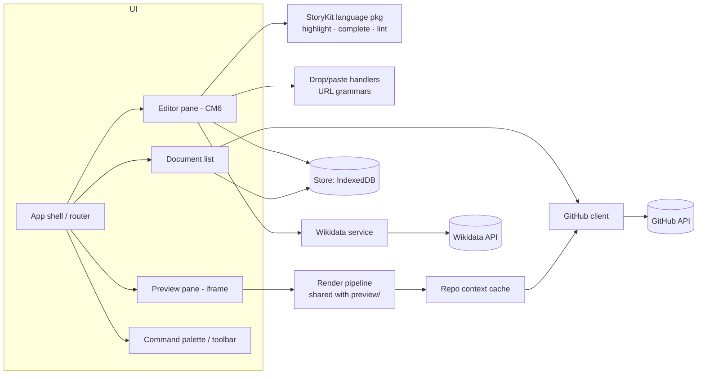

# StoryKit Editor — Specification

| | |
|---|---|
| **Status** | Draft for review |
| **Date** | 2026-07-06 |
| **Component** | `editor/` (new top-level page, sibling of `preview/`) |
| **Related docs** | `preview/index.html` (client-side renderer), `docs/postmessage-protocol.md`, `docs/dependencies.md` |

## 1. Overview

### 1.1 Purpose

A web-based Markdown editor, purpose-built for StoryKit authoring, that runs entirely in the browser. It replaces the current "GitHub web editor + preview bookmarklet in a second window" workflow with a single integrated surface: edit on the left, toggle to a high-fidelity preview, drag media in from Wikimedia Commons, YouTube, or Google Maps, and sync finished work to GitHub.

The editor is a static page hosted by the site itself (like `preview/`), requires no server component, and works offline for everything except preview asset loading, media metadata lookups, and GitHub sync.

### 1.2 Goals

* Zero-install authoring: open a URL, start writing. All state lives in the browser until the author chooses to sync.
* First-class StoryKit support: viewer tags are highlighted, validated, autocompleted, and insertable by drag-and-drop — not just opaque text.
* Preview that authors can trust: the same rendering pipeline as the existing preview tool, so what the editor shows is what GitHub Pages publishes.
* Durable by default: work is never lost to a closed tab, crashed browser, or dropped connection.
* Professional fit and finish: the editor should feel like a product (Typora, Obsidian, StackEdit class), not a demo.

### 1.3 Non-goals

* **Not a WYSIWYG editor.** The document of record is Markdown text; rich-text editing is out of scope.
* **No real-time collaboration.** Single author per document; GitHub is the collaboration layer.
* **No server-side components.** Anything requiring a backend (OAuth token exchange, image proxying) is out of scope for v1 and listed under Future Directions.
* **No site administration.** Config editing, theme customization, and repository management stay in GitHub's UI.

## 2. Context

The repository already contains most of the editor's hardest piece: `preview/index.html` is a complete client-side Jekyll/Chirpy renderer. It fetches a post plus its layout chain, includes, and `_config.yml`, runs LiquidJS with Jekyll-compatible filters, renders Markdown with markdown-it (plus Kramdown-compat plugins for footnotes and attribute lists), applies the Chirpy layout, rewrites URLs to the deployed site, and writes the result into an iframe. StoryKit viewers and action links run their production JavaScript inside that iframe.

The editor **reuses this pipeline** rather than reimplementing it. The principal refactor is separating "fetch the sources" from "render a document," so the renderer can accept the editor's in-memory buffer in place of a file fetched from GitHub (§6.3).

Authors are the audience described in the [Authoring a Visual Narrative](../_admin/2026-07-06-storykit-authoring-a-visual-narrative.md) tutorial: no assumed experience with Git, Jekyll, or Markdown. Every feature must be usable by that person, while remaining unobtrusive for experienced users.

## 3. Primary Workflows

1. **Draft from scratch.** Author opens the editor, clicks *New Post*, gets the front-matter template from `_posts/.template.md`, writes, toggles preview as they go. Work persists locally across sessions.
2. **Enrich with media.** Author finds an image on Wikimedia Commons in another tab, drags it into the editor; a complete `` tag is inserted at the drop point. Same for YouTube videos and Google Maps locations.
3. **Link an entity.** Author selects "Charles Darwin" in their prose, invokes *Link Entity*, picks the right Darwin from a Wikidata search list, and the selection becomes `[Charles Darwin](Q1035)`.
4. **Publish.** Author connects the editor to the site repository, picks (or creates) their working branch, and commits the document to `_posts/`. Subsequent edits show a "local changes" badge until committed. Pull requests remain a GitHub-web step (linked from the editor).
5. **Continue elsewhere.** Author opens the editor on another machine, pulls the file from their branch, and continues; local and remote versions are reconciled per §4.6.4.

## 4. Functional Requirements

Requirements are numbered `FR-<area>.<n>` for traceability. **MUST/SHOULD/MAY** per RFC 2119.

### 4.1 Document Management and Local Persistence

* **FR-DOC.1** The editor MUST store all documents in **IndexedDB** (via a thin wrapper such as `idb`). `localStorage` is used only for small preferences (theme, layout, last-open document) and the existing GitHub token key shared with the preview tool.
* **FR-DOC.2** Document record schema:

  | Field | Type | Notes |
  |---|---|---|
  | `id` | string (ULID) | primary key |
  | `title` | string | derived from front matter `title`, fallback to filename |
  | `path` | string \| null | intended repo path, e.g. `_posts/2026-07-06-my-essay.md` |
  | `content` | string | full Markdown source |
  | `createdAt`, `updatedAt` | ISO 8601 | |
  | `github` | object \| null | `{ owner, repo, branch, sha, syncedAt }` — the blob SHA of the last synced version |
  | `revisions` | array | rolling snapshots, see FR-DOC.4 |

* **FR-DOC.3** **Autosave.** The buffer MUST be persisted after edits with a debounce ≤ 2 s, and flushed on `visibilitychange`/`pagehide`. An unexpected tab close MUST lose no more than the debounce window.
* **FR-DOC.4** **Local revisions.** The editor MUST keep a rolling history of snapshots per document (e.g. one per 10 minutes of active editing, capped at 20) with a simple *Restore* UI. This is crash/mistake insurance, not version control; Git history remains authoritative once synced.
* **FR-DOC.5** **Document list.** A home/side panel MUST list local documents with title, path, updated time, and sync status (local-only / synced / local changes / remote changed). Actions: open, rename path, duplicate, delete (with confirmation), export.
* **FR-DOC.6** **New from template.** *New Post* MUST prefill from the repository's `_posts/.template.md` (fetched when a repo is connected; a bundled fallback template otherwise) and prompt for the title, generating the `yyyy-mm-dd-slug.md` filename automatically.
* **FR-DOC.7** **Import/export.** Authors MUST be able to open a local `.md` file (file picker or drag onto the document list) and download any document as a `.md` file. This is the escape hatch that guarantees no lock-in to browser storage.
* **FR-DOC.8** The editor SHOULD request `navigator.storage.persist()` and surface a warning when the origin is not persisted (Safari's seven-day eviction is the motivating case).

### 4.2 Editing Core (CodeMirror 6)

* **FR-EDIT.1** The editing surface MUST be **CodeMirror 6** with: `@codemirror/lang-markdown` (GFM), `@codemirror/lang-yaml` for the front-matter block, history, search/replace panel, bracket/quote closing, active-line highlight, and drop-cursor.
* **FR-EDIT.2** **StoryKit/Liquid highlighting.** `` tags, ``/``, and kramdown attribute blocks (`{: ... }`) MUST be highlighted distinctly from prose (delimiters, include path, attribute names, attribute values as separate token styles). Implemented as a Markdown parser extension or CM6 `MatchDecorator`-based view plugin over the Markdown tree.
* **FR-EDIT.3** **Tag autocomplete.** Typing `{% inc` or invoking completion inside a tag MUST offer: the viewer includes discovered from the connected repo's `_includes/embed/` (fallback: bundled list), then attribute-name completion per viewer from a bundled attribute catalog (name, type, doc line — sourced from the `_admin` viewer guides). Attribute completions MUST insert `name=""` with the cursor between the quotes.
* **FR-EDIT.4** **Tag linting.** The editor SHOULD flag, as CM6 diagnostics: unknown include paths, unknown attributes, curly ("smart") quotes inside tags, an action link whose viewer `id` does not exist in the document, and a `vis-network` viewer whose `<id>-csv` data block is missing. Lint must never block typing; it is advisory underlines plus a gutter marker.
* **FR-EDIT.5** **Wikidata link affordance.** `[text](Q12345)` links SHOULD get a subtle inline decoration (e.g. a dotted underline and the resolved entity label on hover — see FR-WD.3).
* **FR-EDIT.6** Standard editor conveniences MUST work: keyboard shortcuts for bold/italic/link (`⌘B`/`⌘I`/`⌘K`), heading level cycling, list continuation on Enter, tab-indent in lists, undo/redo across autosaves, word count in the status bar.
* **FR-EDIT.7** The front-matter block SHOULD have light structural validation (YAML parse errors shown as diagnostics; warning when `media_subpath`, `date`/filename, or `published` look inconsistent).

### 4.3 Preview

* **FR-PRE.1** **Toggle.** A single control (button + `⌘E`) MUST switch between *Edit* and *Preview*. A *Split* mode (editor left, preview right) SHOULD be available on screens ≥ 1200 px. The chosen mode persists.
* **FR-PRE.2** **Fidelity.** Preview MUST use the same rendering pipeline as `preview/index.html` — LiquidJS + markdown-it + layout chain + deployed-site assets — refactored per §6.3 so the input is the editor buffer rather than a GitHub fetch. Viewers, action links, entity popups, footnotes, Mermaid, and MathJax MUST behave as on the published site.
* **FR-PRE.3** **Freshness.** In split mode the preview SHOULD re-render debounced (~1 s idle) after edits; in full-preview mode it renders on entry. Because a full re-render replaces the iframe, the preview MUST preserve scroll position across re-renders (restore by nearest heading anchor).
* **FR-PRE.4** **Context resolution.** When a document is bound to a repo, includes/layout/config are fetched from that repo (branch-aware) and cached in IndexedDB with ETag revalidation. When unbound, the pipeline falls back to this starter's deployed defaults so preview still works for drafts.
* **FR-PRE.5** Preview failures (rate limit, network, Liquid error) MUST render an inline diagnostic panel — never a blank iframe. Liquid/Markdown errors SHOULD link back to the offending line in the editor.

### 4.4 Drag-and-Drop Tag Insertion

* **FR-DND.1** The editor MUST accept drops of URLs and images (`text/uri-list`, `text/plain`, `text/html` dataTransfer flavors) onto the editing surface, insert at the drop position (CM6 `posAtCoords`), and place the completed tag on its own line surrounded by blank lines.
* **FR-DND.2** **Wikimedia Commons.** Recognized inputs: `commons.wikimedia.org/wiki/File:...` page URLs, `Special:FilePath/...` URLs, `upload.wikimedia.org/...` direct/thumb URLs, and `` drags from Commons search results. The editor MUST extract the canonical filename and insert:

  ```liquid
  
  ```

  Spaces are converted to underscores; the `File:` prefix is stripped.
* **FR-DND.3** **YouTube.** Recognized inputs: `youtube.com/watch?v=<id>`, `youtu.be/<id>`, `youtube.com/shorts/<id>`, and `youtube.com/embed/<id>`. Insert ``; a `t=`/`start=` query parameter maps to `start="<seconds>"`.
* **FR-DND.4** **Google Maps.** Recognized inputs: URLs containing `/@<lat>,<lng>,<zoom>z`, `?q=<lat>,<lng>`, and `/place/<name>/@<lat>,<lng>,<zoom>z`. Insert:

  ```liquid
  
  ```

  For `/place/...` URLs the place name (URL-decoded, `+`→space) SHOULD additionally populate `caption="<name>"`. Zoom is rounded to one decimal; when absent, omit the attribute (framework default applies). Shortened `maps.app.goo.gl` links cannot be expanded browser-side (no CORS) — the drop MUST degrade to a helpful message telling the author to drag from the expanded URL.
* **FR-DND.5** **Post-insert affordance.** After insertion the tag SHOULD be selected and a small inline hint offered ("Add caption · Add id") so the common next edits are one click. No modal dialogs on the drop path.
* **FR-DND.6** **Unrecognized drops** of URLs MUST fall back to inserting a plain Markdown link, and image files from the local filesystem SHOULD trigger the (future) asset-upload flow or, in v1, an explanatory notice pointing at the local-image workflow in the docs. Drops must never be silently discarded.
* **FR-DND.7** The same URL grammars MUST also be applied on **paste**, offering a non-intrusive "Paste as StoryKit tag?" inline action rather than transforming automatically.

### 4.5 Wikidata QID Resolution

* **FR-WD.1** **Link Entity command.** With text selected, a command (toolbar button, `⌘⇧K`, and slash-menu entry) MUST open a search popup pre-filled with the selection, querying `wikidata.org/w/api.php?action=wbsearchentities&origin=*` (CORS-enabled, no key). Results show label, description, and thumbnail where available; arrow keys + Enter select; the selection becomes `[selected text](Q…)`.
* **FR-WD.2** Searching with no selection MUST insert `[<label>](Q…)` using the chosen entity's label.
* **FR-WD.3** **Hover cards.** Hovering an existing `(Q…)` link SHOULD show a compact card (label, description, thumbnail, "open on Wikidata") using the same batched lookup, cached in IndexedDB for 30 days. This doubles as validation that the QID points where the author thinks.
* **FR-WD.4** Lookups MUST be debounced (≥ 300 ms) and cancelled on popup close; the feature MUST degrade gracefully offline (popup shows an offline notice; manual `Q…` entry still works).

### 4.6 GitHub Sync

* **FR-GH.1** **Authentication.** v1 uses a fine-grained **personal access token** with Contents read/write on the site repository, entered once and stored in `localStorage` under the same key the preview tool uses (single setup step covers both tools). The UI MUST link to the token-creation instructions in the Preview Setup guide. OAuth device flow is a Future Direction (needs no secret but requires a CORS proxy for the token endpoint).
* **FR-GH.2** **Binding.** A document is bound to `{owner, repo, branch, path}`. The connect flow lets the author enter/select a repository, pick an existing branch or create one (`POST /git/refs` from the default branch head), and choose the target path (defaulting to `_posts/<filename>`).
* **FR-GH.3** **Commit (push).** Saving to GitHub uses the Contents API (`PUT /repos/{o}/{r}/contents/{path}`) with the stored blob `sha` for updates and a user-editable commit message (sensible default: `Update <filename>`). On success the stored `sha`/`syncedAt` are updated and the status badge switches to *Synced*.
* **FR-GH.4** **Conflict safety.** A `409`/`422` SHA mismatch means the remote changed since the last sync. The editor MUST NOT force-overwrite: it fetches the remote version and presents a three-choice dialog — *Keep mine (overwrite)*, *Take remote (discard local)*, or *View diff* (side-by-side, read-only) — with the local version snapshotted to revisions (FR-DOC.4) before any resolution. No automatic merge in v1.
* **FR-GH.5** **Pull.** An explicit *Pull latest* action fetches the bound file and replaces the buffer (after the same snapshot). On document open, if the remote SHA differs from the stored one, show a passive "Remote has newer changes" banner — never auto-replace.
* **FR-GH.6** **Status visibility.** The status bar MUST always show the binding (repo · branch · path) and one of: *Local only*, *Synced*, *Local changes*, *Remote changed*, *Conflict*. All network state changes surface as toasts, not alerts.
* **FR-GH.7** Non-goal for v1: syncing image assets. Local-image uploads to `assets/posts/…` via the Contents API are a Future Direction; the tutorial's GitHub-web upload flow remains the documented path.

## 5. Non-Functional Requirements

### 5.1 Robustness

* No data loss on tab close, crash, or navigation (FR-DOC.3); IndexedDB writes are transactional per document.
* All network calls have timeouts and produce actionable error states; the editor never blocks input on network activity.
* The editor is fully functional offline except preview rendering with uncached repo context, media lookups, and sync — each of which shows a specific offline notice.
* Documents up to 1 MB (far beyond any realistic post) must not degrade typing latency; CM6 handles this natively — the constraint is on our decorations/lint, which MUST be incremental (viewport-scoped) not whole-document-per-keystroke.

### 5.2 Security and Privacy

* The PAT never leaves the browser except in `Authorization` headers to `api.github.com`. It is never embedded in URLs, logs, or error reports.
* Preview HTML is written into a sandboxed iframe (`allow-scripts allow-same-origin` only as required by viewer components — match the preview tool's existing posture; see `docs/postmessage-protocol.md` for the message boundary).
* All third-party requests are enumerable and minimal: GitHub API, jsDelivr/esm.sh (pinned versions), Wikidata/Wikimedia APIs, YouTube thumbnail/oEmbed. No analytics.

### 5.3 Performance Budgets

* First interactive (warm cache): < 1.5 s on a mid-range laptop.
* Keystroke-to-paint: < 16 ms at p95 in a 50 KB document with full decorations.
* Edit-to-preview (split mode, cached context): < 2.5 s including debounce.

### 5.4 Accessibility and UX Quality

* Full keyboard operability: every command reachable via keyboard; a `⌘K` command palette exposes all actions with their shortcuts.
* WCAG 2.1 AA contrast in both themes; visible focus states; popups are focus-trapped with `Esc` to dismiss; drag-and-drop has a paste-based equivalent (FR-DND.7) for non-pointer users.
* Light and dark themes following `prefers-color-scheme` with a manual override, visually consistent with the Chirpy site (same font stack and accent palette) so the tool feels native to StoryKit.
* Professional polish checklist: consistent 8 px spacing grid, one accent color, no layout shift on async loads (skeletons/placeholders), empty states with guidance, toasts for async outcomes, confirmation only for destructive actions.

### 5.5 Browser Support

Evergreen Chrome, Edge, Firefox, and Safari ≥ 16.4 (IndexedDB + ES modules + import maps). No IE/legacy support. Mobile: read and light editing must work (responsive layout, toolbar collapses); drag-and-drop is desktop-only by nature.

## 6. Architecture

### 6.1 Shape

A static, buildless single-page app at `editor/index.html` (+ `editor/*.js` ES modules), matching the repository's no-build philosophy (`preview/` sets the precedent). Dependencies load as pinned ES modules via an import map (esm.sh or jsDelivr `+esm`). If module-count/latency proves problematic, fall back to a committed, vendored bundle produced by a one-shot esbuild script in `tools/` — the source layout must not assume a bundler either way.

### 6.2 Modules



### 6.3 Renderer Extraction (the key refactor)

`preview/index.html` currently interleaves fetching and rendering. Extract a shared module — `assets/js/skrender.js` (or `preview/skrender.js`) — with the contract:

```js
renderPost({ content, path, context }) → { html, diagnostics }
// context: { config, locales, layouts, includes, resolveFile(path) }
```

* The preview tool becomes a thin shell: build `context` from GitHub, call `renderPost`.
* The editor builds the same `context` from its IndexedDB cache (populated from the bound repo, or from bundled starter defaults) and passes the **live buffer** as `content`.
* `resolveFile` is the injection point for "files that exist only locally" (future: unsynced assets).

This is the highest-risk work item and is scheduled first (§9, M1).

### 6.4 Storage Summary

| Store | Technology | Contents |
|---|---|---|
| `documents` | IndexedDB | document records (§4.1) |
| `revisions` | IndexedDB | snapshot bodies, FK to document |
| `repoCache` | IndexedDB | fetched includes/layouts/config keyed by `{repo, ref, path}` + ETag |
| `entityCache` | IndexedDB | Wikidata lookups, 30-day TTL |
| preferences | localStorage | theme, layout mode, last document id |
| GitHub PAT | localStorage | same key as preview tool |

## 7. UI Specification

Single-window layout, three regions:

```
┌────────────────────────────────────────────────────────────────┐
│ ☰ StoryKit Editor    my-essay.md ▾         [Edit|Split|Preview] ⚙ │  ← top bar
├──────────┬─────────────────────────────────────────────────────┤
│ Documents│  # front matter (YAML-highlighted)                  │
│  ▸ essay │  ---                                                │
│  ▸ draft │  Prose prose prose [Charles Darwin](Q1035) …        │
│          │            │
│  + New   │                                                     │
├──────────┴─────────────────────────────────────────────────────┤
│ main ▾ · _posts/2026-07-06-essay.md · Local changes · 1,842 w  │  ← status bar
└────────────────────────────────────────────────────────────────┘
```

* **Top bar:** document title menu (rename/duplicate/export/delete), mode segmented control (*Edit / Split / Preview*), overflow menu (GitHub connect, settings, help → links to `/admin` guides).
* **Document sidebar:** collapsible; hidden by default in Preview mode.
* **Status bar:** branch/path binding and sync state (click → sync panel), word count, cursor position, lint count.
* **Toolbar (editor):** minimal — bold, italic, link, heading, list, *Insert viewer* (menu of the six embeds with attribute-prompting snippets), *Link entity*. Everything else lives in the command palette.
* **Drop feedback:** while a recognized item is dragged over the editor, show an insertion caret and a chip naming what will be inserted ("Image viewer · wc:Westgate_Towers_c1905.jpg").

## 8. Technology Selections

| Concern | Choice | Rationale |
|---|---|---|
| Editing core | CodeMirror 6 (`@codemirror/state`, `view`, `lang-markdown`, `lang-yaml`, `autocomplete`, `lint`, `search`) | Required; incremental parsing, first-class decorations/diagnostics, mobile-capable |
| StoryKit language support | Custom CM6 extension package (`editor/lang-storykit.js`) | Nothing off-the-shelf highlights Liquid-in-Markdown + kramdown IALs |
| Markdown/Liquid rendering | markdown-it 14 + plugins, LiquidJS 10 (shared with preview) | Fidelity with the existing pipeline; already proven against Chirpy |
| Persistence | IndexedDB via `idb` (~1 KB) | Structured records, transactions, large-value safety |
| GitHub API | Direct `fetch` (no Octokit) | Four endpoints used; avoids a large dependency |
| Wikidata | `wbsearchentities` / `wbgetentities` with `origin=*` | CORS-enabled, keyless |
| UI framework | None (vanilla ES modules + `<template>`), or Preact if state wiring grows | Match repo's buildless, low-dependency philosophy |
| Icons/typography | Chirpy's font stack + a small inline SVG icon set | Visual consistency with the site |

All CDN dependencies pinned to exact versions in the import map, consistent with `docs/dependencies.md` policy.

## 9. Delivery Plan and Acceptance Criteria

| Milestone | Scope | Acceptance criteria |
|---|---|---|
| **M1 — Renderer extraction** | §6.3 refactor; preview tool migrated onto shared module | Preview tool output byte-comparable to pre-refactor on the Monument Valley post and all `_admin` guides |
| **M2 — Core editor** | App shell, CM6 with Markdown/YAML/StoryKit highlighting, IndexedDB persistence, autosave, document list, import/export | Author drafts a post over multiple sessions with browser restarts and loses nothing; tags visibly highlighted; 50 KB doc types smoothly |
| **M3 — Preview integration** | Toggle + split modes, buffer-fed rendering, repo-context cache, error panel | Monument Valley source pasted into a new doc previews with working viewers and action links; edit-to-preview < 2.5 s |
| **M4 — Media & entities** | Drag/drop + paste grammars for Commons/YouTube/Maps; Wikidata search popup and hover cards | Each documented URL shape drops to a correct tag; entity search resolves "Charles Darwin" → Q1035 in ≤ 3 interactions |
| **M5 — GitHub sync** | PAT setup, binding, branch create, pull/commit, conflict dialog, status surfaces | Round-trip: create → commit to branch → edit remotely → pull-with-conflict handled without data loss (local snapshot verified) |
| **M6 — Polish & a11y** | Command palette, themes, keyboard coverage, empty states, budgets audit | §5.3 budgets met; keyboard-only walkthrough of workflows 1–4; axe-core clean on AA |

Each milestone lands behind the others' stability: M1 is a pure refactor with a regression gate; M2+ ship progressively on the live site (the editor page is inert until linked from docs).

## 10. Risks and Mitigations

| Risk | Impact | Mitigation |
|---|---|---|
| Renderer extraction destabilizes the preview tool | Authors lose their main tool | M1 regression gate (byte-compare corpus); ship behind a `?v2` flag first |
| markdown-it vs Kramdown divergence surfaces more in an editor (authors iterate faster) | Confusing "preview lies" reports | Keep the preview tool's known-limitations panel; deployed site remains authoritative; document in-editor |
| Google Maps URL formats change / short links unexpandable | Drop feature degrades | Grammar table is data-driven and unit-tested; graceful fallback message (FR-DND.4) |
| Buildless CM6 module graph is large (~40 modules) | Slow first load | Import-map preloading; measure — fall back to vendored bundle (§6.1) |
| Safari storage eviction | Silent local data loss | `storage.persist()` + warning banner + export nudge for unsynced docs > 7 days old (FR-DOC.8) |
| PAT in localStorage on shared machines | Token exposure | Documented in setup UI; "Forget token" control; fine-grained single-repo tokens recommended |

## 11. Future Directions (explicitly out of v1)

* Asset upload: drag a local image → commit to `assets/posts/<slug>/` and insert the tag.
* OAuth device-flow sign-in via a minimal token-exchange worker.
* Region-picker integration: open the image viewer's selection UI from the editor to generate `zoomto` links in place.
* Scroll-synced split preview (heading-anchor mapping exists; needs bidirectional wiring).
* Multi-file awareness: front-matter-aware slug/date renames that update the bound path.
* Draft sharing via preview-tool URLs pointing at the author's branch.

## 12. Open Questions

1. Should the editor live in this starter repo (deployed with every site copy, like `preview/`) or in a separate repo serving all StoryKit sites from one canonical URL? *Recommendation: in-repo, matching the preview tool — zero-config for template copies.*
2. Is the shared PAT key with the preview tool acceptable, or should scopes differ (preview needs read-only)? *Recommendation: share; fine-grained tokens make write scope explicit at creation time.*
3. Minimum split-mode width and mobile posture — is read-only preview sufficient on phones?
4. Should tag lint (FR-EDIT.4) run against the *connected repo's* actual include files to catch site-specific customizations, or only the bundled catalog?
